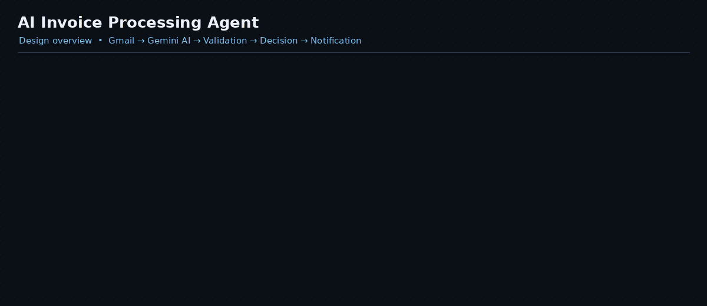
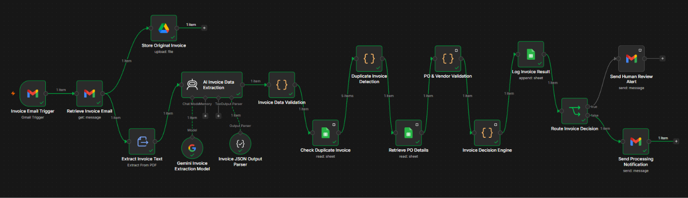

## Design Overview



---

## Project Presentation

[View the AI Invoice Processing Agent Presentation (PDF)](AI_Invoice_Processing_Agent_Presentation.pdf)

---

## Project Overview

The **AI Invoice Processing Agent** is an Agentic AI-based business process automation project developed as part of a **Building AI Agents for Business Process Automation** project.

The system automates the invoice processing lifecycle, from receiving an invoice through Gmail to generating a final processing decision.

The workflow combines:

- Workflow automation
- Large Language Model (LLM)-based information extraction
- Deterministic business rules
- Google Workspace integrations
- Human-in-the-Loop exception handling

The LLM extracts structured information from unstructured invoice documents, while deterministic business rules control validation, Purchase Order matching, duplicate detection, and the final processing decision.

---

## Project Objective

Build an automated invoice processing workflow that:

- Receives invoice PDFs through Gmail
- Extracts structured invoice information using Google Gemini
- Validates invoice data
- Detects duplicate invoices
- Matches invoices with Purchase Orders
- Validates vendor, amount and currency information
- Applies deterministic business rules
- Generates an invoice processing decision
- Logs processing results
- Stores original invoice documents
- Sends automated notifications
- Routes exceptions to human reviewers

---

## Business Problem

Invoice processing involves several repetitive manual activities:

1. Receiving invoices through email
2. Opening invoice documents
3. Reading invoice information
4. Manually extracting data
5. Validating invoice amounts
6. Checking Purchase Orders
7. Detecting duplicate invoices
8. Approving or reviewing invoices
9. Maintaining processing records
10. Notifying stakeholders

### Key Challenges

- Manual data-entry effort
- Extraction and validation errors
- Duplicate invoice processing
- Invoice and PO mismatches
- Delayed exception handling
- Lack of centralized processing records

This project addresses these challenges by automating repetitive steps while keeping deterministic controls and human review for exceptions.

---

## Why Agentic AI?

The workflow follows an agent-like process:

```text
Trigger
   ↓
Understand
   ↓
Extract Information
   ↓
Retrieve Business Data
   ↓
Validate
   ↓
Apply Rules
   ↓
Decide
   ↓
Act
   ↓
Escalate When Required
```

The AI component understands and extracts information from unstructured invoice documents. Critical financial and business decisions are handled by deterministic rules rather than by the LLM alone.

---

## System Architecture

```text
                     ┌──────────────────────┐
                     │        Gmail         │
                     │    Invoice Email     │
                     └──────────┬───────────┘
                                │
                                ▼
                     ┌──────────────────────┐
                     │         n8n          │
                     │   Workflow Engine    │
                     └──────────┬───────────┘
                                │
                                ▼
                     ┌──────────────────────┐
                     │  Invoice PDF / Text  │
                     │      Extraction      │
                     └──────────┬───────────┘
                                │
                                ▼
                     ┌──────────────────────┐
                     │    Google Gemini     │
                     │  AI Data Extraction  │
                     └──────────┬───────────┘
                                │
                                ▼
                     ┌──────────────────────┐
                     │  Invoice Validation  │
                     │  Deterministic Rules │
                     └──────────┬───────────┘
                                │
                                ▼
                     ┌──────────────────────┐
                     │  Duplicate Detection │
                     └──────────┬───────────┘
                                │
                                ▼
                     ┌──────────────────────┐
                     │ PO & Vendor Matching │
                     └──────────┬───────────┘
                                │
                                ▼
                     ┌──────────────────────┐
                     │    Decision Engine   │
                     └──────────┬───────────┘
                                │
                     ┌──────────┴──────────┐
                     ▼                     ▼
              ┌──────────────┐      ┌───────────────┐
              │   APPROVED   │      │ HUMAN REVIEW  │
              │  / REJECTED  │      │     ALERT     │
              └──────┬───────┘      └───────┬───────┘
                     │                      │
                     └──────────┬───────────┘
                                ▼
                     ┌──────────────────────┐
                     │     Invoice Log      │
                     │    Google Sheets     │
                     └──────────────────────┘
```

---

## End-to-End Workflow

```text
Invoice Email Trigger
        ↓
Retrieve Invoice Email
        ↓
Extract Invoice Text
        ↓
AI Invoice Data Extraction
        ↓
Invoice Data Validation
        ↓
Check Duplicate Invoice
        ↓
Duplicate Invoice Detection
        ↓
Retrieve PO Details
        ↓
PO & Vendor Validation
        ↓
Invoice Decision Engine
        ↓
Log Invoice Result
        ↓
Route Invoice Decision
       ↙              ↘
Send Human Review    Send Processing
Alert                Notification
```

---

## Workflow Components

| Component | Purpose |
|---|---|
| Gmail | Receives invoice emails and sends notifications |
| n8n Cloud | Workflow orchestration and automation |
| Google Drive | Stores original invoice PDFs |
| Extract from File | Extracts text from PDF invoices |
| Google Gemini | Extracts structured invoice information |
| Structured Output Parser | Ensures structured JSON output |
| JavaScript / n8n Code | Implements validation and business logic |
| Google Sheets | Stores PO Master and Invoice Log |
| Human-in-the-Loop | Handles invoice exceptions |

---

## AI Invoice Data Extraction

Google Gemini converts unstructured invoice text into structured JSON.

### Extracted Fields

- Invoice Number
- Vendor Name
- Invoice Date
- Due Date
- PO Number
- Subtotal
- Tax
- Total Amount
- Currency

### Example Output

```json
{
  "invoice_number": "INV-1008",
  "vendor_name": "ABC Supplies Pvt Ltd",
  "invoice_date": "2026-09-28",
  "due_date": "",
  "subtotal": 40000,
  "tax": 5000,
  "total_amount": 50000,
  "currency": "INR",
  "po_number": "PO-501"
}
```

### Important Design Principle

> The LLM extracts information; deterministic business rules control the decision.
> The AI model does **not** directly approve or reject an invoice.

---

## Invoice Validation

After AI extraction, deterministic validation rules are applied.

### Required Field Checks

- Invoice Number
- Vendor Name
- Invoice Date
- PO Number
- Subtotal
- Tax
- Total Amount

### Arithmetic Validation

The workflow checks: `Subtotal + Tax = Total Amount`

```text
Subtotal       = ₹40,000
Tax            = ₹5,000
Expected Total = ₹45,000

Invoice Total  = ₹50,000

Result = INVALID
```

The invoice is then routed to **Human Review**.

---

## Duplicate Invoice Detection

The system checks the invoice number against the `Invoice_Log`.

```text
Invoice Number
      ↓
Search Invoice_Log
      ↓
Already Exists?
   ↙          ↘
 YES           NO
  ↓             ↓
DUPLICATE      NEW
  ↓
REJECTED
```

**Rule:** If the invoice number already exists in the Invoice Log, then `Decision = REJECTED`. This prevents repeated processing of the same invoice.

---

## Purchase Order Matching

The workflow retrieves the relevant Purchase Order from the `PO_Master` sheet.

### Matching Criteria

- PO Number
- Vendor Name
- Invoice Amount
- Currency
- PO Status

### Example

```text
Invoice:
  PO Number = PO-501
  Vendor    = ABC Supplies Pvt Ltd
  Amount    = ₹45,000
  Currency  = INR

PO Master:
  PO Number = PO-501
  Vendor    = ABC Supplies Pvt Ltd
  Amount    = ₹45,000
  Currency  = INR
  Status    = Approved

Result = MATCHED
```

If a mismatch is detected, the invoice is routed to **Human Review**.

---

## Workflow Preview


## Decision Engine

The final decision is generated using deterministic business rules.

| Condition | Decision |
|---|---|
| Duplicate invoice | **REJECTED** |
| Invoice validation failed | **HUMAN REVIEW** |
| PO mismatch | **HUMAN REVIEW** |
| Vendor mismatch | **HUMAN REVIEW** |
| Amount mismatch | **HUMAN REVIEW** |
| Currency mismatch | **HUMAN REVIEW** |
| PO not approved | **HUMAN REVIEW** |
| All checks pass | **APPROVED** |

### Decision Flow

```text
Duplicate?
    │
    ├── YES → REJECTED
    │
    └── NO
          ↓
Validation Failed?
    │
    ├── YES → HUMAN REVIEW
    │
    └── NO
          ↓
PO / Vendor / Amount / Currency Match?
    │
    ├── NO → HUMAN REVIEW
    │
    └── YES
          ↓
PO Approved?
    │
    ├── NO → HUMAN REVIEW
    │
    └── YES
          ↓
       APPROVED
```

---

## Human-in-the-Loop

The workflow does not automatically process every exception. Invoices requiring additional investigation are routed to a human reviewer.

### Human Review Conditions

- Invoice validation failure
- Amount mismatch
- Vendor mismatch
- Currency mismatch
- PO mismatch
- PO not approved
- Other business-rule exceptions

### Process

```text
Exception Detected
        ↓
HUMAN REVIEW
        ↓
Result Logged
        ↓
Review Email Sent
        ↓
Manual Investigation
```

This provides additional control over exceptional invoices.

---

## Data Storage

### PO_Master

Contains Purchase Order information.

| Field |
|---|
| PO_Number |
| Vendor_Name |
| PO_Amount |
| Currency |
| Status |

### Invoice_Log

Stores processed invoice results.

| Field |
|---|
| Invoice_Number |
| Vendor_Name |
| Invoice_Date |
| Due_Date |
| PO_Number |
| Subtotal |
| Tax |
| Total_Amount |
| Currency |
| Validation_Status |
| Validation_Issues |
| PO_Match_Status |
| Decision |
| Reason |
| Processed_Date |

---

## Google Drive Storage

The original invoice PDF is stored in Google Drive.

**Purpose:**

- Preserve original invoice documents
- Maintain traceability
- Provide access to source documents
- Support human investigation of exceptions

---

## Email Notifications

The system generates automated Gmail notifications.

### Normal Processing Notification

- Invoice Number
- Vendor
- Invoice Date
- PO Number
- Invoice Amount
- Validation Status
- PO Match Status
- Decision
- Reason
- Processed Date

### Human Review Alert

- Invoice Number
- Vendor
- PO Number
- Invoice Amount
- Validation Status
- Duplicate Status
- PO Match Status
- Decision
- Reason
- Validation Issues

---

## Testing

The workflow was tested using multiple invoice scenarios.

| Test Case | Scenario | Expected Result |
|---|---|---|
| TC-01 | Valid invoice + matching PO | APPROVED |
| TC-02 | Invoice amount ≠ PO amount | HUMAN REVIEW |
| TC-03 | Duplicate invoice number | REJECTED |
| TC-04 | Invoice arithmetic mismatch | HUMAN REVIEW |

### Testing Covered

- Invoice extraction
- Structured AI output
- Invoice validation
- Duplicate detection
- PO matching
- Vendor matching
- Amount matching
- Currency validation
- Decision logic
- Human-review routing
- Gmail notifications
- Google Sheets logging
- Google Drive storage

---

## Key Design Principles

1. **AI for Unstructured Data** — Gemini extracts information from invoice documents.
2. **Structured AI Output** — The Structured Output Parser constrains the AI response to the required JSON format.
3. **Deterministic Financial Validation** — Financial calculations are performed using explicit rules.
4. **Duplicate Protection** — Previously processed invoice numbers are checked before processing.
5. **PO Verification** — Vendor, amount, currency and PO status are validated.
6. **Human-in-the-Loop** — Exceptions are routed to human reviewers.
7. **Auditability** — Processing results and decision reasons are stored in the Invoice Log.

---

## Technology Stack

| Technology | Purpose |
|---|---|
| n8n Cloud | Workflow automation and orchestration |
| Google Gemini | AI-based invoice data extraction |
| Gmail | Invoice intake and email notifications |
| Google Drive | Original invoice document storage |
| Google Sheets | PO Master and Invoice Log |
| JavaScript | Validation and business logic |
| Structured JSON | Standardized AI output |
| Human-in-the-Loop | Exception handling |

---

## Author

**Shubham Vishwakarma**
